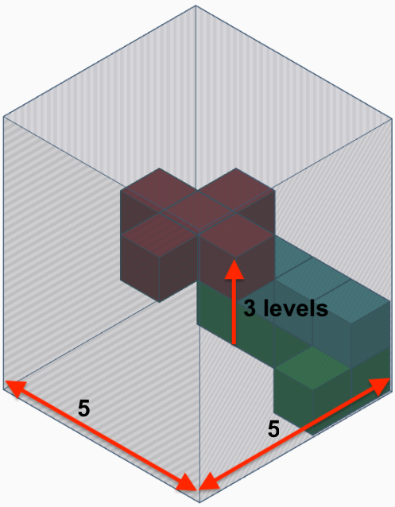

# stack-pentomino-solver
This haskell application return the higher stack when you pile up pentominoes in a grid of n x n.
#### Problem
Given a grid of n x n, pile up m pentominoes, every pentomino is a set of cubes of 1x1x1, and return the higher level get it.
#### Example
In the figure below it is a sample of a grid of 5 x 5 with 3 pentominoes and a higher stack of 3.


### Steps to Run

1. Install Stack following [this guide](https://docs.haskellstack.org/en/stable/README/).
2. Once stack is installed in the command line run the following commands to build the app
```
> cd /path/to/stack-pentomino-solver
> stack build
```
3. Once the build passed run the example:
```
> stack exec pento-exe
```
This will return a tuple where the first element is the higher stack and the second element is the stack of figures represented by an accumulator matrix.  
```
(
 3,
 [[[0,0,0,3,2],
   [0,0,3,3,3],
   [0,0,0,3,2],
   [0,0,0,0,2],
   [0,0,0,1,2]]]
)
```
The combination use for the example are the same as the image above.


